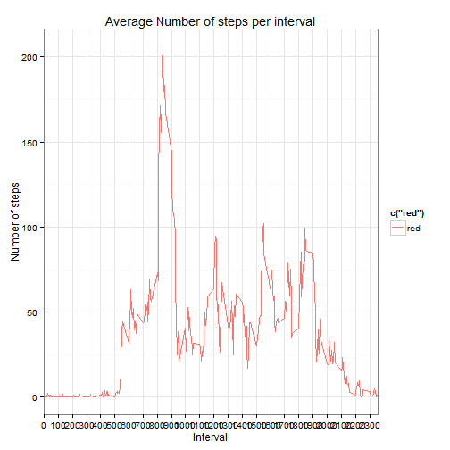
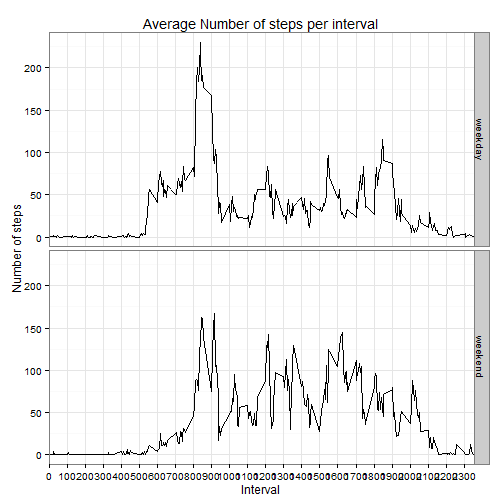

# Reproducible Research: Peer Assessment 1

We need to write a report, a complete R Markdown file that answers the questions detailed below.

## Data
The data can be downloaded from the course web site:

* Dataset: Activity monitoring data [52K]

The variables included in this dataset are:

* **steps**: Number of steps taking in a 5-minute interval (missing values are coded as NA)

* **date**: The date on which the measurement was taken in YYYY-MM-DD format

* **interval**: Identifier for the 5-minute interval in which measurement was taken

The dataset is stored in a comma-separated-value (CSV) file and there are a total of 17,568 observations in this dataset.

We use of data from a personal activity monitoring device. This device collects data at 5 minute intervals through out the day. The data consists of two months of data from an anonymous individual collected during the months of October and November, 2012 and include the number of steps taken in 5 minute intervals each day.

## Loading and preprocessing the data
Data is alredy available in the working directory from GitHub.
Data is loaded in the `data` variable

### Load data
Simple use of R funtion about CSV file

```r
data<-read.csv('activity.csv')
str(data)
```

```
## 'data.frame':	17568 obs. of  3 variables:
##  $ steps   : int  NA NA NA NA NA NA NA NA NA NA ...
##  $ date    : Factor w/ 61 levels "2012-10-01","2012-10-02",..: 1 1 1 1 1 1 1 1 1 1 ...
##  $ interval: int  0 5 10 15 20 25 30 35 40 45 ...
```

### Preprocessig data
Date should be mutated to have proper datetime class variable.
To easy maniluplate we use `dplyr package`

```r
library(dplyr)
data<-mutate(data,date=as.POSIXct(date,format='%Y-%m-%d'))
str(data)
```

```
## 'data.frame':	17568 obs. of  3 variables:
##  $ steps   : int  NA NA NA NA NA NA NA NA NA NA ...
##  $ date    : POSIXct, format: "2012-10-01" "2012-10-01" ...
##  $ interval: int  0 5 10 15 20 25 30 35 40 45 ...
```

## What is mean total number of steps taken per day?
Missing values can be ignored with `na.rm=TRUE` option

### Calculate the total number of steps taken per day
Using `group_by` we prepare the aggregation by `date`, afterwards we define a new dataset `dataxday` where `total` contains the total number of steps taken per day

```r
dataxday<-group_by(data,date)
dataxday<-summarize(dataxday,total=sum(steps))
summary(dataxday)
```

```
##       date                         total      
##  Min.   :2012-10-01 00:00:00   Min.   :   41  
##  1st Qu.:2012-10-16 00:00:00   1st Qu.: 8841  
##  Median :2012-10-31 00:00:00   Median :10765  
##  Mean   :2012-10-30 23:32:27   Mean   :10766  
##  3rd Qu.:2012-11-15 00:00:00   3rd Qu.:13294  
##  Max.   :2012-11-30 00:00:00   Max.   :21194  
##                                NA's   :8
```

### Make a histogram of the total number of steps taken each day


```r
hist(dataxday$total,xlab='Total number of steps taken',main='Freguency of total number of steps x day')
```

 

### Calculate and report the mean and median of the total number of steps taken per day

```r
# mean na.rm=TRUE
avgd<-mean(dataxday$total,na.rm=TRUE)
# median na.rm=TRUE
medd<-median(dataxday$total,na.rm=TRUE)
totd<-sum(dataxday$total,na.rm=TRUE)
```
The **mean** of original dataset is: **1.0766189 &times; 10<sup>4</sup>** and the **median** is **10765**
While the total number of steps in the whole dataset is **570608**

## What is the average daily activity pattern?
We need to summarize data by interval. Further more we use `ggplot2` as graphics package 
### Make a time series plot  of the 5-minute interval (x-axis) and the average number of steps taken, averaged across all days (y-axis)
Using `group_by` we prepare the aggregation by `date`, afterwards we define a new dataset `stepxint` where `avgstep` contains the average number of steps

```r
stepxint<-group_by(data,interval)
stepxint<-summarize(stepxint,avgstep=mean(steps,na.rm=TRUE))
library(ggplot2)
g1<-qplot(interval,avgstep,data=stepxint,geom='path',main="Average Number of steps per interval",xlab='Interval',ylab='Number of steps')
g1<-g1+scale_x_discrete(breaks=seq(0, 2400, by=100))
g1
```

 

### Which 5-minute interval, on average across all the days in the dataset, contains the maximum number of steps?
Looking the previuos plot we can say that the 5-minute interval is between **800** and **900** :

```r
int<-stepxint$interval[stepxint$avgstep==max(stepxint$avgstep)]
h<-as.integer(int/100)
m<-int%%100
```

To be precise the interval is the one labeled **835** it means at **8:35**


## Imputing missing values

### Calculate and report the total number of missing values in the dataset

```r
sum(is.na(data$date))
```

```
## [1] 0
```

```r
sum(is.na(data$interval))
```

```
## [1] 0
```

```r
sum(is.na(data$steps))
```

```
## [1] 2304
```

```r
newdata<-data
iddna<-which(is.na(newdata$steps))
n<-length(iddna)
```
It means we have **2304** nrows with missing values in the `steps` variable. `iddna` is a vector with the row index in the `newdata` dataset about missing values.  

### Devise a strategy for filling in all of the missing values in the dataset.
The approach is to fill in missing number of steps value with the corresponding average per interval.
This concept is enforce defining a specific function:


```r
FUNFIL<-function(int){round(stepxint$avgstep[stepxint$interval==int])}
```


### Create a new dataset that is equal to the original dataset but with the missing data filled in.
Using `iddna` we fill in the missing value. The result dataset is `newdata`

```r
for (i in 1:n) {
idint<-iddna[i]
newdata$steps[idint]<-FUNFIL(newdata$interval[idint])
}
```
### Make a histogram of the total number of steps taken each day and Calculate and report the mean and median total number of steps taken per day.


```r
ndataxday<-group_by(newdata,date)
ndataxday<-summarize(ndataxday,total=sum(steps))

# Total steps per day
# Histogram
hist(ndataxday$total,xlab='Total number of steps taken',main='Freguency of total number of steps x day')
```

 

```r
avgnd<-mean(ndataxday$total,na.rm=TRUE)
mednd<-median(ndataxday$total,na.rm=TRUE)
totnd<-sum(ndataxday$total,na.rm=TRUE)
```

The **mean** of new dataset is: **1.0765639 &times; 10<sup>4</sup>** and the **median** is **1.0762 &times; 10<sup>4</sup>**
While the added total number of steps is **8.6096 &times; 10<sup>4</sup>**


## Are there differences in activity patterns between weekdays and weekends?

### Create a new factor variable in the dataset with two levels - "weekday" and "weekend" indicating whether a given date is a weekday or weekend day.


```r
Sys.setlocale("LC_TIME", "English") ## sorry my personal LOCALE is Italian
```

```
## [1] "English_United States.1252"
```

```r
newdata<-mutate(newdata,wk=factor(weekdays(date) %in% c('Sunday','Saturday'), labels = c("weekday", "weekend")))
str(newdata)
```

```
## 'data.frame':	17568 obs. of  4 variables:
##  $ steps   : num  2 0 0 0 0 2 1 1 0 1 ...
##  $ date    : POSIXct, format: "2012-10-01" "2012-10-01" ...
##  $ interval: int  0 5 10 15 20 25 30 35 40 45 ...
##  $ wk      : Factor w/ 2 levels "weekday","weekend": 1 1 1 1 1 1 1 1 1 1 ...
```

### Make a panel plot containing a time series plot of the 5-minute interval (x-axis) and the average number of steps taken, averaged across all weekday days or weekend days (y-axis).


```r
stepxwint<-group_by(newdata,wk,interval)
stepxwint<-summarize(stepxwint,avgstep=mean(steps))
g1<-qplot(interval,avgstep,data=stepxwint,geom='path',facets=wk~.,main="Average Number of steps per interval",xlab='Interval',ylab='Number of steps')
g1<-g1+scale_x_discrete(breaks=seq(0, 2400, by=100))
g1
```

 

